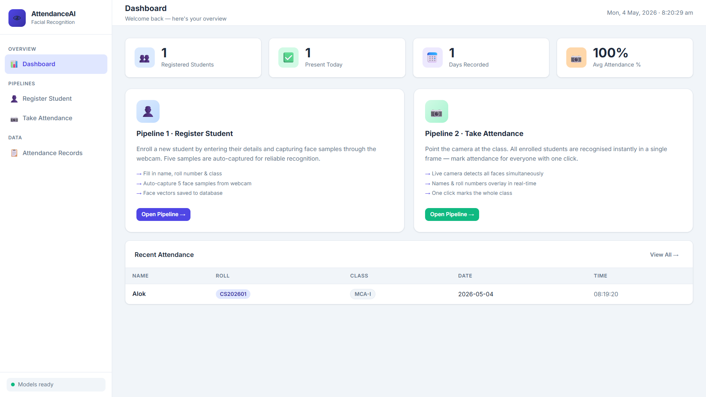
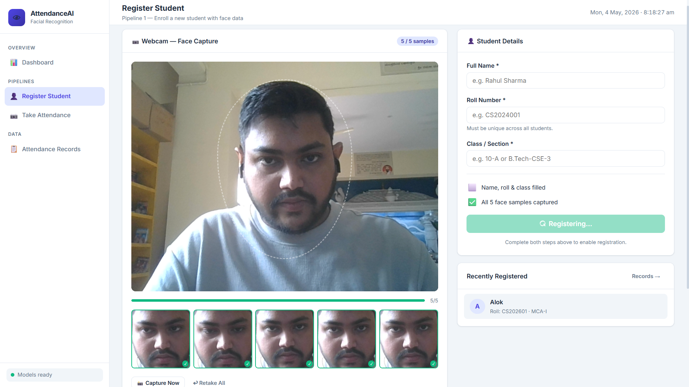
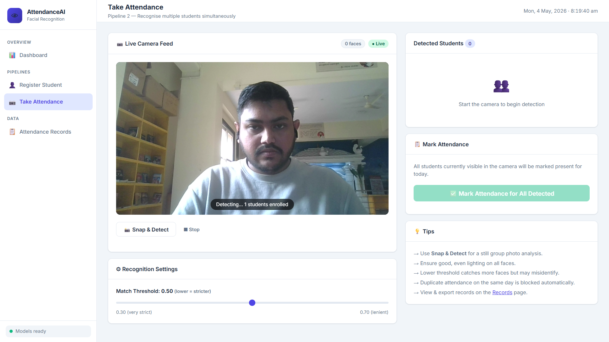
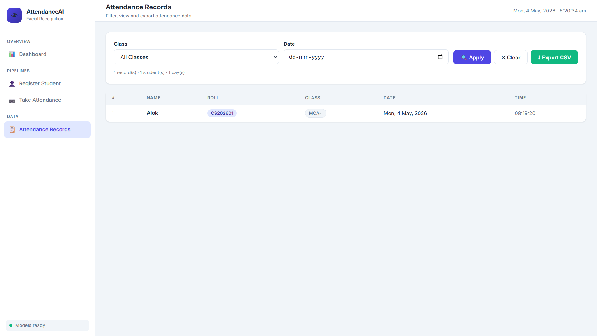

<<<<<<< HEAD
<div align="center">

  <h1>👁 Mass Attendance AI</h1>

  <p><strong>A browser-native facial recognition attendance system that replaces manual roll-calls with a single camera frame — detecting, identifying, and marking every student in the room simultaneously, with no server GPU, no paid APIs, and no heavy Python dependencies.</strong></p>

  <p>
    
    
    
    
    
    
  </p>

  <sub>Built by <strong>Alok Deep</strong> · Portfolio project demonstrating browser-native AI, REST API design, and full-stack development.</sub>

</div>

---

## Why This Project

Taking attendance in a classroom of 60 students consumes 5–10 minutes every session — roughly 100+ hours of teaching time lost per year, per class. Biometric devices cost ₹8,000–₹25,000 per unit and require proprietary software. Cloud face recognition APIs charge per-call and send student biometric data to third-party servers.

This project tries a different answer: run the entire recognition pipeline inside the browser using WebAssembly-backed TensorFlow.js, talk to a lightweight Flask backend that only stores vectors and marks dates, and ship the whole thing as a zero-dependency web app a school IT department can run on any existing laptop.

> **Why browser-side recognition, not a Python model on the server?** Because the question a school administrator actually has is: *"can I deploy this without a GPU server, a cloud account, or a data-science team to maintain it?"* face-api.js answers yes — it runs SSD MobileNet V1 at 3–5 fps on a four-year-old laptop CPU, handles multiple faces in one frame, and never sends a pixel off-device.

---

## App Preview

<table>
  <tr>
    <td width="50%"></td>
    <td width="50%"></td>
  </tr>
  <tr>
    <td><strong>Dashboard</strong> — KPI stats, pipeline shortcuts, and live recent-attendance feed</td>
    <td><strong>Pipeline 1 · Register Student</strong> — Webcam auto-captures 5 face samples; 128-d descriptors saved to SQLite alongside name, roll, and class</td>
  </tr>
  <tr>
    <td width="50%"></td>
    <td width="50%"></td>
  </tr>
  <tr>
    <td><strong>Pipeline 2 · Take Attendance</strong> — Live camera detects all enrolled faces simultaneously every 500 ms; bounding boxes + names overlay on canvas; one click marks the whole class</td>
    <td><strong>Attendance Records</strong> — Filter by class and date, paginated table view, one-click CSV export</td>
  </tr>
</table>

---

## Two Pipelines at a Glance

| Capability | Where it lives |
|---|---|
| **Student registration with face data** | `/register` — form + webcam auto-capture, 5 samples per student |
| **128-d face descriptor extraction** | `face-api.js` → `FaceRecognitionNet` running in-browser via TensorFlow.js |
| **Multi-face simultaneous detection** | `SsdMobilenetv1Options` + `detectAllFaces()` on a 500 ms `setInterval` |
| **Real-time bounding box overlay** | HTML5 `<canvas>` positioned over `<video>`, coordinates from `faceapi.resizeResults()` |
| **Identity matching with threshold control** | Euclidean distance across all stored descriptors; adjustable 0.30–0.70 slider |
| **Duplicate attendance guard** | `UNIQUE(student_id, date)` constraint in SQLite — enforced at the DB layer |
| **Batch attendance in one click** | `POST /api/attendance` with all detected student IDs; per-student marked/already-marked response |
| **Filtered records + CSV export** | `/records` — class + date filters, `Blob` → `<a download>` client-side export |
| **Model availability indicator** | `GET /api/models/status` → green dot in sidebar when all 3 model manifests present |
| **Zero cloud dependency** | All processing on-device; Flask serves locally; no paid APIs, no data leaves the machine |

---

## Architecture

```
┌──────────────────────────────────────────────────────────────────────┐
│                   PIPELINE 1 · REGISTER STUDENT                      │
│   Webcam → SSD MobileNet V1 (detect) → Face Landmark 68 Tiny        │
│   → ResNet-34 Recognition Net → 5 × 128-d Float32Array descriptors  │
│   Student form (name, roll, class) → POST /api/students              │
└────────────────────────────┬─────────────────────────────────────────┘
                             ▼
┌──────────────────────────────────────────────────────────────────────┐
│                       DATA STORE · SQLite                            │
│  students   (id · name · roll · class · descriptors JSON · photo)   │
│  attendance (id · student_id · date · time)                          │
│  UNIQUE(student_id, date) — duplicate attendance blocked at DB layer │
└──────────────┬───────────────────────────────┬──────────────────────┘
               ▼                               ▼
┌──────────────────────────┐       ┌───────────────────────────────────┐
│  PIPELINE 2 ·            │       │          REST API LAYER           │
│  TAKE ATTENDANCE         │       │  Flask · app.py                   │
│                          │       │                                   │
│  Webcam live feed        │       │  GET  /api/students               │
│  detectAllFaces() every  │       │  POST /api/students               │
│  500 ms via setInterval  │       │  DEL  /api/students/<id>          │
│                          │       │  POST /api/attendance             │
│  Euclidean distance vs   │       │  GET  /api/attendance             │
│  all stored descriptors  │       │  GET  /api/classes                │
│  threshold slider 0.3–0.7│       │  GET  /api/attendance/dates       │
│                          │       │  GET  /api/models/status          │
│  One click → all marked  │       └──────────────────┬────────────────┘
└──────────────────────────┘                          ▼
                                   ┌───────────────────────────────────┐
                                   │           UI LAYER                │
                                   │  Jinja2 templates · HTML · CSS    │
                                   │  face-api.js 0.22.2 via CDN       │
                                   │  Canvas overlay for bbox + names  │
                                   │  4 pages · shared sidebar nav     │
                                   └───────────────────────────────────┘
```

**Design decisions worth calling out:**

- **Face recognition in the browser, not on the server.** The Flask backend never touches an image. It stores descriptor vectors and dates. This means no GPU, no OpenCV install headache, no dlib compilation — and no student photos transmitted over a network.
- **SQLite, not a separate DB process.** Clone the repo, run two commands, open a browser. The `attendance.db` file is created automatically. For a deployment that needs concurrent writes, the swap to PostgreSQL is a connection-string change.
- **`UNIQUE(student_id, date)` in the schema, not in application code.** Business rules belong at the database layer. The API still returns a per-student `already_marked` status so the UI can communicate it, but the constraint cannot be bypassed.
- **`setInterval` for detection, not `requestAnimationFrame`.** rAF fires at 60 fps — far more than face-api.js can process, causing queued microtask backpressure. A 500 ms interval saturates the model without starving the event loop, keeping the video feed smooth.
- **All 5 face descriptors stored per student, none averaged.** Averaging in embedding space can drift the vector away from any single real capture. Storing all 5 and taking the minimum Euclidean distance at query time is more robust to lighting and pose variation.

---

## Face Recognition Layer

| Model | Source | What it answers | Output |
|---|---|---|---|
| **SSD MobileNet V1** | face-api.js / TensorFlow.js | "Where are the faces in this frame?" — handles multiple overlapping faces, works at 3–5 fps on CPU | Bounding box + confidence score per face |
| **Face Landmark 68 Tiny** | face-api.js | "What are the exact positions of eyes, nose, mouth?" — used to align the face crop before descriptor extraction | 68 (x, y) landmark points |
| **Face Recognition Net** (ResNet-34) | face-api.js / TensorFlow.js | "What is the unique mathematical signature of this face?" — same person across different lighting and pose yields vectors within distance 0.50 | 128-dimensional Float32Array |
| **Euclidean Distance Matching** | Vanilla JS | "Is this live face the same as any enrolled student?" — compares live descriptor against all stored descriptors, returns the nearest match below threshold | Match identity + distance score (0 = identical) |

Model weights are downloaded once by `setup_models.py` (~18 MB total) and served locally by Flask from `static/models/`. The sidebar shows a live green/red status dot via `GET /api/models/status`.

---

## Honest Limitations

This system is designed to be deployable on any existing school laptop with zero cost. That trade-off has real constraints worth understanding before you run it in a classroom.

**What works reliably:**
- Groups of **5–15 students** standing within 2–3 metres of the camera, good frontal lighting
- **Snap & Detect** mode for a still group photo — one thorough pass is more accurate than the live loop
- Controlled environments: a lab, a seminar room, students queuing at a desk

**Where it breaks down:**

| Limitation | Root cause | Practical impact |
|---|---|---|
| **Faces far from the camera** | SSD MobileNet V1 accuracy drops sharply for faces smaller than ~80 px in the frame | Back-row students in a 60-seat hall will be missed or misidentified |
| **Side profiles and downward-facing heads** | Registration captures frontal faces only; the recognition net is sensitive to pose angle | Students looking at their desks, or turned sideways, will not match |
| **Laptop webcam field of view** | A standard built-in webcam covers ~60–70°, not a full classroom | You can only reliably capture the students directly in front of you |
| **Backlit or shadowed faces** | Uneven lighting changes descriptor values enough to exceed the match threshold | Students near windows or in dark corners will fail to match |
| **CPU speed at scale** | Each detected face is compared against all stored descriptors (N faces × S students × 5 descriptors) | Smooth up to ~15 simultaneous faces; noticeable lag beyond 25–30 |
| **Threshold sensitivity** | A single global threshold applies to all students and lighting conditions | Lower threshold → fewer false positives but more missed students; higher → more matches but more wrong ones |

---

## Hardware Requirements

| | Minimum (works, with limits) | Recommended (comfortable classroom use) |
|---|---|---|
| **CPU** | Intel Core i5 (8th gen) / Ryzen 5 | Intel Core i7 (10th gen+) / Ryzen 7 |
| **RAM** | 4 GB | 8 GB |
| **Camera** | Built-in laptop webcam (720p) | External USB webcam — 1080p, wide-angle (90°+), e.g. Logitech C920 (~₹4,000) |
| **Lighting** | Overhead fluorescent — acceptable | Diffused front lighting; avoid strong backlighting from windows |
| **Browser** | Any Chromium-based browser (Chrome, Edge) | Google Chrome — best WebAssembly / TF.js performance |
| **Internet** | Required once (model download ~18 MB) | Not required after setup |
| **GPU** | Not required | Not required — all inference runs on CPU via TF.js WASM |
| **OS** | Windows 10+ · macOS 12+ · Ubuntu 20.04+ | Same |

---

## Practical Workarounds for Larger Classes

If you need to cover more students than a laptop webcam comfortably handles, these approaches work without changing any code:

- **Row-by-row batching** — have students approach in groups of 10–15, click Snap & Detect once per group, then Mark Attendance. Takes ~2 minutes for 60 students instead of 10.
- **Dedicated wide-angle USB camera** — a 1080p 90° webcam (₹3,000–5,000) roughly triples the usable capture area and resolves the FOV bottleneck.
- **Dedicated lighting** — a single clip-on LED ring light (~₹800) facing the students eliminates the backlit-window problem entirely.
- **Threshold tuning** — if your room has consistent lighting, lower the threshold to 0.40 for stricter matching; raise to 0.60 if students are farther away and you're getting too many misses.

**When this architecture is the wrong tool:** a full lecture hall of 200+ students filmed from a podium requires server-side inference (YOLOv8-face + ArcFace on a basic GPU), a high-resolution IP camera, and frame preprocessing to upscale small face crops before descriptor extraction. The browser-side approach here is the correct trade-off for *free, zero-setup, privacy-preserving* deployment in small-to-medium classrooms — not for stadium-scale attendance.

---

## Quick Start

**Prerequisites:** Python 3.9+ · A webcam · Any modern browser (Chrome / Edge recommended)

```bash
# 1. Clone the repository
git clone https://github.com/AlokTheDataGuy/mass-attendance.git
cd mass-attendance

# 2. Install the only Python dependency
pip install flask

# 3. Download face-api.js model weights (~18 MB, one-time)
python setup_models.py

# 4. Start the server
python app.py
```

Open **http://localhost:5000** in your browser.

| Page | URL | Purpose |
|---|---|---|
| Dashboard | http://localhost:5000/ | KPI overview + pipeline shortcuts |
| Register Student | http://localhost:5000/register | Pipeline 1 — enrol a student with face data |
| Take Attendance | http://localhost:5000/attendance | Pipeline 2 — mark whole class in one click |
| Attendance Records | http://localhost:5000/records | Filter, view, and export attendance |

> **Faster re-run on an existing install:** `setup_models.py` skips files already present — it's safe to re-run.

---

## Project Structure

```
mass-attendance/
├── app.py                          # Flask backend · REST API · SQLite init
├── setup_models.py                 # One-time model weight downloader (~18 MB)
├── requirements.txt                # Single dependency: Flask
├── attendance.db                   # SQLite database (auto-created on first run)
│
├── static/
│   ├── models/                     # face-api.js weight files (downloaded by setup_models.py)
│   │   ├── ssd_mobilenetv1_model-weights_manifest.json
│   │   ├── ssd_mobilenetv1_model-shard1 / shard2
│   │   ├── face_landmark_68_tiny_model-weights_manifest.json
│   │   ├── face_landmark_68_tiny_model-shard1
│   │   ├── face_recognition_model-weights_manifest.json
│   │   └── face_recognition_model-shard1 / shard2
│   ├── css/
│   │   └── style.css               # Full design system · CSS variables · sidebar layout
│   └── js/
│       ├── register.js             # Pipeline 1 · webcam auto-capture · descriptor extraction
│       ├── attendance.js           # Pipeline 2 · detectAllFaces() · matching · mark API
│       └── records.js              # Filter controls · table render · CSV export
│
├── templates/
│   ├── base.html                   # Jinja2 base layout · sidebar · clock · toast system
│   ├── index.html                  # Dashboard · stats · pipeline cards · recent table
│   ├── register.html               # Registration page · camera + form grid
│   ├── attendance.html             # Attendance page · camera + detected panel grid
│   └── records.html                # Records page · filter bar + table
│
└── screenshots/
    ├── dashboard.png
    ├── register.png
    ├── take_attendance.png
    └── records.png
```

*Legacy scripts (`add_faces.py`, `test.py`, `face_recogition.py`) from the original dlib/KNN prototype are retained for reference but are not used by the new pipeline.*

---

## Tech Stack

| Layer | Choice | Why |
|---|---|---|
| **Database** | SQLite | Zero-setup; single file; auto-created at startup; `UNIQUE` constraints enforce business rules at the schema level |
| **Backend** | Flask | Minimal surface area for a read/write REST API; Jinja2 templating included; single `pip install flask` |
| **Face Detection** | SSD MobileNet V1 (face-api.js) | Best multi-face accuracy in the face-api.js suite; handles overlapping faces in group shots better than Tiny Face Detector |
| **Face Alignment** | Face Landmark 68 Tiny (face-api.js) | Lightweight 68-point model; necessary for stable descriptor extraction across head poses |
| **Face Recognition** | ResNet-34 Recognition Net (face-api.js) | Produces 128-d embeddings with < 0.50 intra-class Euclidean distance; open-weight, no API key |
| **Runtime** | TensorFlow.js (WebAssembly backend) | Runs the above models in-browser on CPU; no GPU, no server-side inference, no data leaves the device |
| **Frontend** | HTML5 · CSS3 · Vanilla JS | No build step; no npm; loads instantly; `<canvas>` overlay for bbox drawing |
| **Styling** | Custom CSS design system | CSS variables for consistent theming; sidebar layout; toast notification system; responsive grid |
| **Templates** | Jinja2 (via Flask) | Server-side render for initial HTML; JS takes over for all dynamic content |
| **API calls** | `fetch()` (native browser) | Zero dependency; all endpoints return JSON; CSV export via `Blob` + `URL.createObjectURL` |

---

## License

MIT — free to use, modify, and distribute for educational and institutional purposes.

---

## Author

**Alok Deep** — Full-stack developer (MERN) building toward data science / AI engineering roles.

[LinkedIn](https://www.linkedin.com/in/alokthedataguy/) · [Portfolio](https://www.alokthedataguy.in/) · [Email](mailto:alokdeep9925@gmail.com)
=======
# Mass Attendance System

A web-based mass attendance system using facial recognition technology powered by Flask, OpenCV, dlib, and machine learning.

🚧 Work in Progress 🚧
This project is still under development. Stay tuned for updates!

🔹 Status: In Progress
🔹 Next Steps: Applying latest techniques to improve accuracy.

📌 Feel free to check back later! 🚀

## Features

- 🎯 **Real-time Face Recognition**: Uses Haar Cascade, dlib, and K-Nearest Neighbors (KNN) algorithm  
- 📝 **Student Registration**: Capture facial data through webcam  
- ✅ **Attendance Tracking**: Automatically records attendance with timestamps  
- 📊 **Attendance Reports**: View attendance records in CSV format  
- 👥 **Student Management**: Add/remove students from the system  
- 🌓 **Dark/Light Mode**: User-friendly interface with dark mode support  
- 📱 **Responsive Design**: Works on both desktop and mobile devices  
- 🔊 **Text-to-Speech**: Audio feedback for important actions  

## Technologies Used

- **Backend:** Python, Flask  
- **Computer Vision:** OpenCV, Haar Cascade, dlib  
- **Machine Learning:** scikit-learn, KNN classifier  
- **Frontend:** HTML5, CSS3, JavaScript  
- **Data Storage:** Pickle files for facial data, CSV for attendance records  

## Installation

### Prerequisites

- Python 3.7+  
- Webcam  
- pip package manager  

### Steps

1. Clone the repository:  
   ```bash
   git clone https://github.com/AlokTheDataGuy/mass-attendance.git  
   cd mass-attendance
   ```

2. Install the required packages:  
   ```bash
   pip install -r requirements.txt
   ```

3. Run the application:  
   ```bash
   python add_faces.py
   python app.py
   ```

4. Open your web browser and go to `http://localhost:5000` to access the system.

## Contributing

Contributions are welcome! Please fork the repository and submit a pull request.

## License

This project is licensed under the MIT License.
>>>>>>> c70a5d80ed9f8770b6d4f506e32112a734a81f8e
